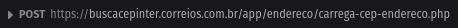

## Form url-encoded

Analisando o site usando o DevTools (ou Inspecionar) do navegador, indo na aba de Rede e ao fazer uma pesquisa, pude notar uma requisição `POST` sendo realizada.

no proprio de DevTools pude notar que essa chamada retorna um `JSON` com todos os dados necessarios, nesse caso usando um cep aleatorio de São Paulo.

assim começo a preparar a segunda abordagem para obter os dados, usando o mesmo recurso pude ver quais dados foram enviados para realizar essa chamada `POST`.

com isso soube que as informações era do tipo `FormData`, para testar utilizo o [Insomnia](https://insomnia.rest/) sabendo que os dados no formulario do site são apenas o endereço e o tipo para realizar a requisição com sucesso acabo informando apenas os dois no insomnia.

